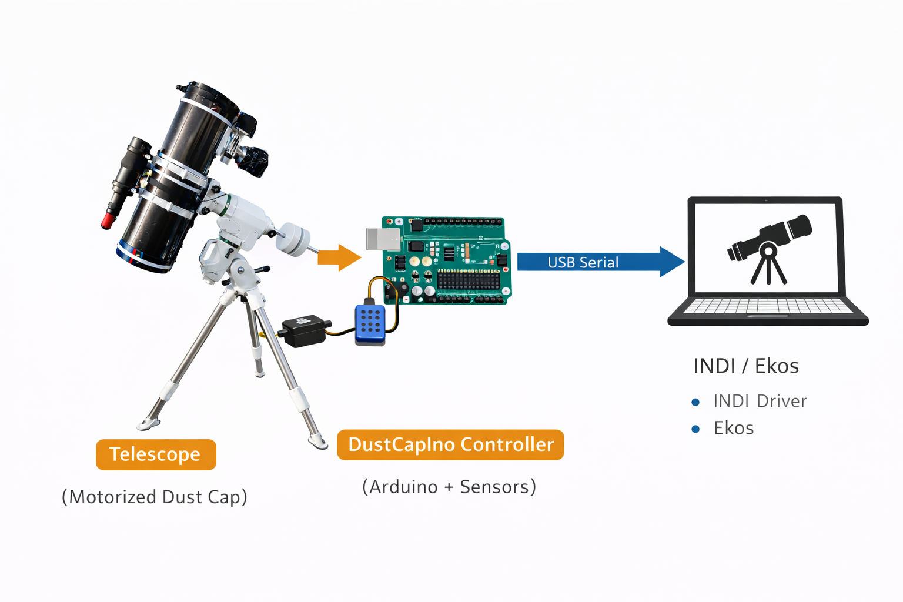

# DustCapIno INDI Driver


INDI driver for the **DustCapIno observatory controller**.

DustCapIno is an Arduino-based controller that provides automated control of a telescope dust cap, flat-field illumination panel, and environmental sensors.

The driver integrates with **INDI** and works with **KStars / Ekos**.

## Why this project exists

Many observatory setups use separate devices for dust cap control, flat-field illumination and environmental monitoring.

DustCapIno was created to combine these functions into a **single compact controller** that integrates cleanly with the INDI ecosystem.

The goals of the project are:

* Provide a **reliable automated dust cap** for remote observatories
* Integrate a **flat-field panel** for calibration frames
* Expose **environmental sensor data** to INDI
* Offer **robust diagnostics and safety features**
* Maintain a **simple and transparent serial protocol**

The project is designed for **fully unattended astrophotography systems**, where reliability and safe operation are critical.

## System overview


*System overview of the DustCapIno observatory controller.*

DustCapIno connects the telescope dust cap hardware to the INDI ecosystem
via a simple USB serial protocol. The controller manages the servo motor,
flat-field panel and environmental sensors, while the INDI driver exposes
the functionality to Ekos.

## Features

* Motorized telescope **dust cap control**
* **Flat-field light panel** with brightness control
* **Safety lock** to prevent light when cap is open
* **Environmental sensors** (temperature and humidity via DHT)
* **Diagnostics panel**

  * Controller voltage
  * Free RAM
  * Servo PWM
  * Movement state
* Automatic **serial port detection**
* **Reconnect watchdog**
* **Smart polling** depending on device state

---

## Hardware

DustCapIno controller typically includes:

* Arduino-compatible microcontroller
* Servo motor for dust cap
* LED flat-field panel
* DHT22 temperature & humidity sensor

---

## Repository Structure

```
indi-dustcapino
│
├── driver
│   ├── dustcapino.cpp
│   ├── dustcapino.h
│   └── CMakeLists.txt
│
├── firmware
│   └── dustcapino.ino
│
├── docs
│   └── protocol.md
│
├── README.md
├── LICENSE
└── .gitignore
```

---

## Build Instructions

Clone the repository:

```
git clone https://github.com/bjober/indi-dustcapino.git
```

Build the driver:

```
cd indi-dustcapino/driver
mkdir build
cd build
cmake ..
make
```

---

## Running the Driver

For testing:

```
indiserver -vvv ./indi_dustcapino
```

To install system-wide:

```
sudo make install
```

The driver will be installed to:

```
/usr/local/bin/indi_dustcapino
```

---

## Using with KStars / Ekos

1. Start **KStars**
2. Open **Ekos**
3. Add **DustCapIno** as an **Auxiliary device**
4. Connect the device
5. Control dust cap and flat panel from the **DustCap / LightBox tabs**

---

## Example Workflow

A typical imaging session using DustCapIno with Ekos might look like this:

### 1. Observatory startup

* Start **INDI server**
* Connect DustCapIno controller
* Verify dust cap status and environmental sensors

### 2. Telescope preparation

* **Unpark dust cap**
* Slew telescope to target
* Begin focusing and guiding

### 3. Imaging session

* Capture light frames normally
* DustCapIno monitors system status via the INDI driver

### 4. Flat frame acquisition

When the imaging session ends:

1. Park the telescope
2. Close the **dust cap**
3. Turn on the **flat-field panel**
4. Capture flat frames automatically in Ekos

### 5. Shutdown

* Turn off flat panel
* Park the dust cap
* Disconnect devices

This workflow enables a **fully automated calibration process**, which is especially useful for remote observatories and unattended imaging sessions.

## Firmware Compatibility

This driver requires **DustCapIno firmware version 1.4 or newer**.

Firmware source is located in:

```
firmware/dustcapino.ino
```

---

## Serial Protocol

### Commands

```
CMD:OPEN
CMD:CLOSE
CMD:ANGLE:<value>
CMD:STATUS
CMD:LIGHT_ON
CMD:LIGHT_OFF
CMD:BRIGHTNESS:<value>
CMD:READ_DHT
CMD:HELLO
```

### Firmware Responses

```
HELLO:DUSTCAPINO,...
STATUS:<state>,<angle>,<brightness>,<safety>
DHT:<temperature>,<humidity>
DBG pulse=<value> VCC=<value> RAM=<value> moving=<0|1>
```

### Error Messages

```
SERVO_STALL
SERVO_POWER_FAIL
MOVE_TIMEOUT
FAILSAFE_CLOSE
```

---

## Development

After modifying the driver source code, rebuild using:

```
cd driver/build
make
```

Then run the driver again using `indiserver`.

---

## License

This project is licensed under the MIT License.

---

## Development Status

DustCapIno is under active development and is currently used in a working observatory setup.  
The focus is on reliability and stable operation with INDI / Ekos.

## Author

Björn Bergman
